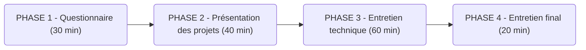

# AIS_Titre_Professionnel
Documents officiels du titre professionnel AIS mouture 2023

Lien officiel de la documentation : https://www.banque.di.afpa.fr/EspaceEmployeursCandidatsActeurs/EGPResultat.aspx?cr=administrateur&cd=&ct=01352m02&type=t 

# 👀 Contenu du dépôt :
* :point_right: Fiche de communication AIS 2023 (`Fiche_de_communication_AIS_2023.pdf`)
  Ce document présente l'emploi type d'un AIS, basé sur des enquêtes métiers
* :point_right: Référentiel Emploi Activité Compétence - REAC (`REAC_AIS_V02_30052023.pdf`)
  Ce document aborde les points suivants :
    - Présentation de l’évolution du titre professionnel
    - Contexte de l’examen du titre professionnel
    - Liste des activités
    - Vue synoptique de l’emploi-type
    - Fiche emploi type
    - Fiches activités types de l’emploi
    - Fiches compétences professionnelles de l’emploi
    - Fiche compétences transversales de l’emploi
    - Glossaire technique
    - Glossaire du REAC
* :point_right: Référentiel d'Evaluation - RE (`REV2_AIS_V02_30052023.pdf`)
  Ce document présente comment est organisé le titre professionnel, les modalités d'évaluation, ainsi que les documents et livrable que tu dois préparer.
* :point_right: Le modèle officiel du Dossier Professionnel (DP) (`1-dossier_professionnel_version_traitement_de_texte.docx`)
---

# :clipboard: Présentation des Activités Types et Compétences Professionnelles
Les compétences requises pour l'obtention du titre professionnel sont regroupées en trois activités types :

| CCP                                                                                            | Compétences types                                                                        |
|------------------------------------------------------------------------------------------------|------------------------------------------------------------------------------------------|
| Activité Type 1 : Administrer et sécuriser les infrastructures                                 | Appliquer les bonnes pratiques dans l'administration des infrastructures                 |
|                                                                                                | Administrer et sécuriser les infrastructures réseaux                                     |
|                                                                                                | Administrer et sécuriser les infrastructures systèmes                                    |
|                                                                                                | Administrer et sécuriser les infrastructures virtualisées                                |
| Activité Type 2 : Concevoir et mettre en œuvre une solution en réponse à un besoin d'évolution | Concevoir une solution technique répondant à des besoins d'évolution de l'infrastructure |
|                                                                                                | Mettre en production des évolutions de l’infrastructure                                  |
|                                                                                                | Mettre en oeuvre et optimiser la supervision des infrastructures                         |
| Activité Type 3 : Participant à la gestion de la cybersécurité                                 | Participer à la mesure et à l’analyse du niveau de sécurité de l’infrastructure          |
|                                                                                                | Participer à l’élaboration et à la mise en oeuvre de la politique de sécurité            |
|                                                                                                | Participer à la détection et au traitement des incidents de sécurité                     |

---

# :watch: Les différentes phases

---

# :page_with_curl: Résumé du RE
Avant de te présenter les différentes phase du déroulement de ton examen, il faut préciser les éléments qui seront en possession du jury et qui les aiderons à prendre une décision :
* Un livret ECF (Evaluations passées en Cours de Formation). Il s'agit d'un dossier officiel que ton formateur rédige et qui reprend les différentes évaluations que tu as passé en formation. Ce dossier indique si tu as réussi les évaluation et dans le cas ou tu n'a pas totalement reussi, les démarches que ton formateur a mis en place pour te permettre de les reussir (révision, apport supplémentaire de support, d'accompagnement ...).
* Ton dossier de projet. Le contenu de ce dossier est expliqué ci-après.
* Ton dossier professionnel et ses anexes. Il s'agit d'un document officiel que tu dois préparer. tu trouveras sur ce [lien](https://www.dossierprofessionnel.fr/) toutes les informations te permettant de le préparer dans les règles de l'art.
* Tes réponses au questionnaire professionel
* Ta performance lors de l'entretien final

Le jury se base exclusivement sur ces élémentspour prendre sa décision. A aucun moment, le formateur ou le centre de formation influence leur décision.
C'est pourquoi tu dois préparer au mieux les éléments dont tu as la maîtrise (ton DP, ton dossier de projet et ta présentation).

## PHASE 1 : La partie questionnaire (sans jury)
* Il s'agit de la première phase de l'examen
* Cette partie sera réalisée par l'ensemble des candidats en même temps, généralement dans une salle surveillée.
* Tu devras étudier une documentation technique rédigée en anglais puis répondre à 4 questions :
    * 2 questions fermées (QCM) posées en français
    * 2 questions ouvertes posées en anglais. Tes réponses seront elles aussi rédigées en anglais, et devront être courtes.
* La durée totale de cette phase est de 30 minutes

## PHASE 2 : La partie projet (à préparer en amont + présentation devant le jury)
* Tu dois réaliser un ou des projets en entreprise ou en formation.
* Ton tuteur et ton formateur doivent te fournir un cahier des charges ou une expression des besoins pour que tu puisses réaliser ton ou tes projets.
* Ce ou ces projets doivent couvrir l'ensemble des compétences types citées dans la paragraphe précédent.
* Tu devras présenter ton ou tes projet en réalisant un `dossier projet` imprimé et relié réunissant l'ensemble des projets et une présentation de type `diaporama` réunissant elle aussi l'ensemble des projets.
* Il est préférable de présenter des projets issus de ton expérience en entreprise mais dans le cas ou ceux-ci ne couvrent pas l'intégralité des compétences du REAC, tu peux présenter des projets complémentaires réalisés en formation. C'est dans ce but que nous proposons plusieurs projets au cours de ta formation.
* Ton dossier de projet doit contenir les éléments ci-après mais n'impose pas de nombre de page minimal ni maximal.
* Ta présentation orale doit durer 40 minutes.

### → Le dossier de projet
* Pour les projets réalisés en entreprise, le dossier projet doit suivre ce plan précis :
1. La liste des compétences mises en ouvre dans le cadre du projet
2. Le cahier des charges ou l'expression des besoins du projet
3. La gestion de projet (planning et suivi, environnement humain et technique, objectifs de qualité)
4. Un argumentaire du choix des solutions retenues en précisant les critères et les méthodes de sélection
5. L’organisation de la mise en oeuvre
6. les relations avec les principaux acteurs du projet
7. Une synthèse et une conclusion

* Pour les projets réalisés en eformation, le dossier projet doit suivre ce plan précis :
1. La liste des compétences mises en oeuvre dans le cadre du projet
2. L’expression des besoins du projet
3. L’environnement technique
4. Les réalisations permettant la mise en oeuvre des compétences obligatoires non couvertes par les projets en période d’entreprise

### → La présentation orale (40 minutes)
* Tu vas présenter tes différents projets dans un diaporama
* Pour les projets réalisés en entreprise, la présentation doit suivre ce plan précis :
1. Une présentation de l’entreprise et/ou du service
2. Le cahier des charges ou expression des besoins du projet, contraintes, livrables attendus
3. La gestion de projet (planning et suivi, environnement humain et technique, objectifs de qualité)
4. La solution retenue (critères de décision, évaluation, argumentation)
5. Les spécifications techniques du projet, élaborées par le candidat, comprenant de préférence un schéma de l’infrastructure et les différents matériels, outils et technologies utilisés
6. Une présentation de la mise oeuvre

* Pour les projets réalisés en formation, la présentation doit suivre ce plan précis :
1. L’expression des besoins du projet
2. L’environnement technique
3. Les réalisations permettant la mise en oeuvre des compétences obligatoires non couvertes par les projets en période d’entreprise

## PHASE 3 : La partie entretien technique (devant le jury)
* Après avoir présenté tes projets, le jury va engager la partie entretien technique.
* Il s'agit ici d'un échange avec le jury, qui va revenir sur ta présentation et ton dossier, pour s'assurer de ta maîtrise des compétences présentées.
* Il pourra aussi te poser des questions qui ne sont pas en rapport avec ta présentation
* Cet entretien dure 1 heure

## PHASE 4 : l'entretien final ( avec le jury)
* Cette dernière phase dure 20 minutes
* Il s'agit d'un échange avec le jury au sujet de ton `dossier professionnel`.

## Résumé de ce que tu as à faire
* Rédiger un dossier de projet
* Réaliser un diaporama
* Réaliser un dossier professionnel

---

# :thumbsup: Conseils

## Questionnaire professionnel
* Ne perd pas de temps sur une question que tu ne comprends pas, passe plutôt à la suivante, tu reviendras sur ces questions à la fin, tu auras plus de chance d'avoir les idées plus claires sur sa signification ou ce qu'on attend de toi.
* Retiens bien les questions auxquelles tu as répondu. Il y a de grandes chances que le jury revienne dessus lors de l'entretien final. Même si ces questions t'on mises en difficultés, le fait d'être allé chercher la réponse à postériori (avant ton passage devant le jury) et de restituer la réponse lors des échanges avec le jury est un gage de professionnalisme et d'engagement de ta part.

## Présentation des projets
* Connais-tu l'expression : `Vous n'aurez jamais une deuxième chance de faire une bonne première impression` ? Celle-ci correspond parfaitement à la situation. 
* Le jury va chercher à observer dans un premier temps ta présentation générale. L'admin est souvent en contact avec ses collaborateurs ou clients, il est en quelque sorte la vitrine de son entreprise ou de son service. Il se doit donc d'avoir un comportement irréprochable, d'avoir une posture professionnelle, dans un souci de qualité de service. À cet instant, la pression se fait ressentir, certains d'entre vous seront pétrifiés par le stress, d'autres essaierons de le masquer en parlant tout le temp … RESPIRE … détend toi.
* Choisis un langage approprié (pas de vulgarité, pas de copinage).
* Prépare au maximum ta prestation orale avec ton formateur ou des proches. Exerce toi à respecter le bon timing, à présenter chacun des slides.

## Entretien technique
* Souviens toi, le jury est composé de personnes en poste, il parle le même langage que toi, un langage technique. C'est le moment de restituer le vocabulaire technique appris tout au long de la formation et en entreprise.
* Le jury reviendra sur ta présentation orale et ton dossier de projet. Essaie de prévoir à l'avance les questions qu'il peuvent teposer, les points pas très clairs, les choix technologique que tu as fais ...

## Entretien final
* La posture professionnelle est aussi importante que les compétences techniques : il s'agit ici d'une discussion autour de ta vision du métier d'Administrateur d'Infrastructures Sécurisées.
* Il peut arriver que le jury revienne sur tes tâches et missions exercées durant ta période en entreprise, ce qui s'est bien passé ou au contraire, ce que tu as trouvé difficile.
* Prouve au jury que tu as réalisé tes missions avec professionnalisme, que tu as été totalement intégré à l'équipe au sein de ton entreprise et que tes compétences relationnelles et techniques t'on permis de mener à bien les missions déléguées par ton tuteur.
* Le jury peut être amener à te questionner sur 2ton parcours professionnel antérieur, sur ce qui ta conduit à suivre cette formation, sur le futur de ton parcours professionnel (chercher un emploi, continuer la formation pour viser un titre plus haut, …), sur les démarches déjà effectuées pour occuper un poste (réalisation de ton CV, démarchage d'entreprises, continuation de ta collaboration avec l'entreprise d'alternance à travers un contrat CDD, CDI …)
  
## Dossier professionnel
* Soit le plus explicite possible, apporte des éléments pertinents comme preuve de réalisation et choisi des réalisations techniques dont tu as la maîtrise.
* Ne produit pas un DP de seulement quelques pages, cela sera perçu comme un manque d'investissement de ta part.

